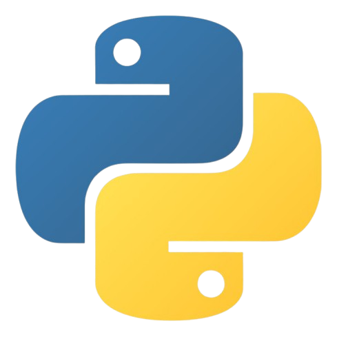
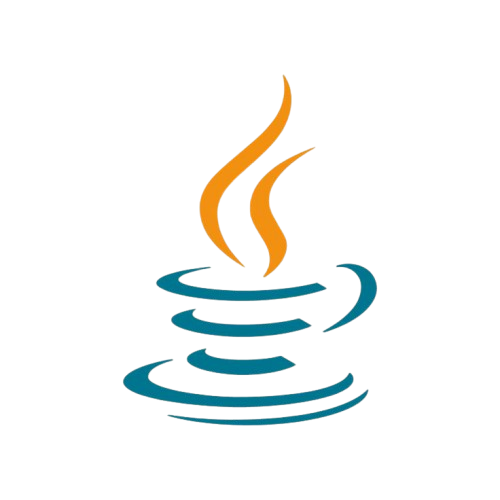
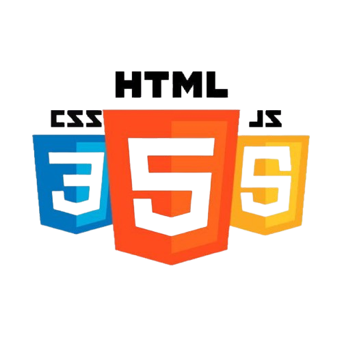
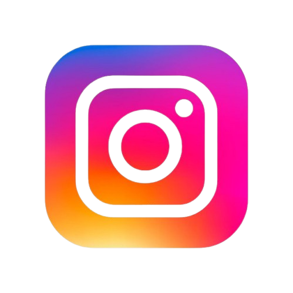
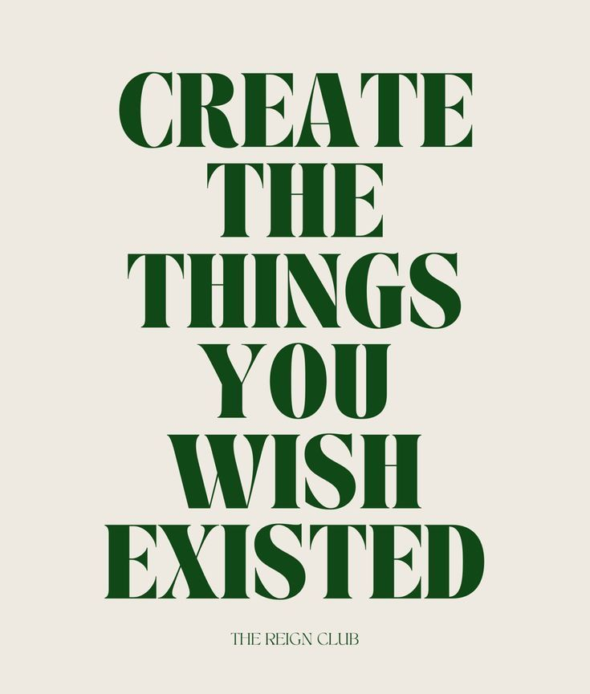

## Hi there 👋
## Bio
**Name:** Clara Catania  
**Field:** IT   
**Experience:** [Hi, I'm a passionate developer]    
**Location:** [Italy]    

## Programming Languages I use

## Social Media
  
  

## Featured Content
  
  

---
### Additional Images
  
  
  
  

<!--
**ClaraCatania/ClaraCatania** is a ✨ _special_ ✨ repository because its `README.md` (this file) appears on your GitHub profile.

Here are some ideas to get you started:

- 🔭 I’m currently working on ...
- 🌱 I’m currently learning ...
- 👯 I’m looking to collaborate on ...
- 🤔 I’m looking for help with ...
- 💬 Ask me about ...
- 📫 How to reach me: ...
- 😄 Pronouns: ...
- ⚡ Fun fact: ...
-->
